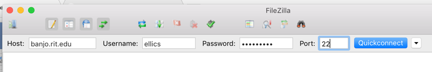
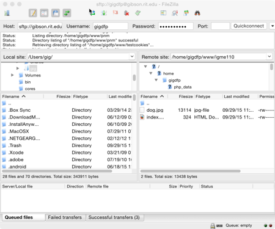
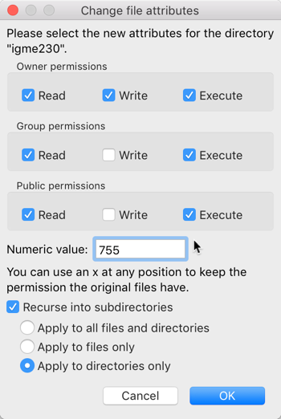
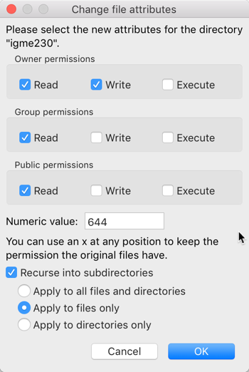

# IGME-230 Web Design &amp; Implementation, Fall 2017: Uploading Files to people.rit.edu

I expect students in this class to have a basic working knowledge of HTML, CSS, and publishing to RIT's web hosting environment (people.rit.edu). For GDD and New Media Interactive students, that material was covered in IGME-110. For New Media Design students, my understanding is that you have also taken a class that covers basic web technologies.

If in your introductory web class you used the CIAS web server rather than RIT's people.rit.edu server, you'll need to get up to speed on using the RIT server. Here's a quick explanation of how to upload yor web files there. 

## banjo.rit.edu vs people.rit.edu

The web server for individual users' files at RIT is people.rit.edu -- every RIT user has web space there. 

However, the files that are displayed on people.rit.edu are actually stored on a server called banjo.rit.edu. So when you're uploading files using FTP, you're going to upload them to banjo.rit.edu. But when you're viewing those files through a browser, you're going to access them at people.rit.edu. 

## Preparing Files to Upload

On your computer, create a folder called igme230, and inside of that folder put another folder called test. Inside of the test directory, put an HTML file and any necessary images or CSS files associated with it. (These can be files from a previous class, or something you create just for this purpose.)

## Using SFTP

You can use whichever SFTP (secure File Transfer Program) you'd like to uplaod files to the server. In the IGM labs, we have FileZilla installed, so that's what's used in this documentation. (You can download FileZilla for your own computer at https://filezilla-project.org/download.php?show_all=1 -- if you're using Windows, I strongly suggest downloading the .zip file rather than the .exe file, since the executable file will try to install browser addons that can cause all kinds of problems.) 

Launch FileZilla.  Fill in the fields at the top with the following information, and click “Quickconnect”:

FileZilla may ask you if you want it to remember passwords—if you’re doing this in the lab, tell it no. If this is the first time you've used FileZilla on a lab computer, it may also give you a warning about an “unknown host key”—if that happens, check the box saying “Always trust this host” and then click OK. If you entered your user ID and password correctly, you should now see something like this:

The pane on the bottom left shows the files on your computer’s hard drive. In this case, it’s showing everything, including hidden files, that are on the main level of my computer’s hard drive. The pane on the right shows all the files in your directory on RIT’s web server. 

In the pane on the left side (local site files), you’ll need to find the igme230 directory that you just created. If you put it on an external drive, the drive should show up in the Volumes directory. If you put it on the Desktop, it should be in the student directory inside of the Users directory. If you have trouble finding your files, ask for help. 

In the pane on the right side (server files), double click on the www directory. If you've never uploaded files to this RIT server before, the directory should be empty. If you've used it to publish files from another class, there may be some directories or files there. 

Once you've got the www directory open on the right side, and the igme230 directory visible on the left side, you’re going to drag the igme230 directory from the left to the right side. This will copy the igme230 folder and all of its contents to the www directory on the server. The file list on the right side should update to show the igme230 directory. 

Now you need to test the files on the web server, to see if they’re accessible. Use a browser to go to `http://people.rit.edu/youruserid/igme230/test/` (substituting your RIT ID for *youruserid*)

If the files and images show up, great! But it’s very possible that they won’t, because the access to the files may not be set properly by default. In that case, you'll probably get a 403 Access Forbidden error message. That means you need to change the permissions on the directories and files that you just uploaded so that they're accessible by the web server. 

## Changing Folder and File Permissions on banjo.rit.edu
In the server panel on the right, make sure you have the www folder (not the igme230 folder) selected on the server. Right click on the folder in the right pane, choose “File Permissions” and make sure the permissions include read write and execute for the owner (that’s you), and read and execute for everyone else. The number in the box at the bottom should read “755” which is shorthand for those permissions. (You can either type the number into the box at the bottom, or check the boxes next to the permissions you want.) Make sure the box that reads "recurse into subdirectories" is selected, and choose "Apply to directories only." Click OK. This should change the permissions for the www directory, and all directories below of it, including the igme230 directory and the test directory. 

Once you’ve checked the permissions on the folders, you need to also check the permissions for the individual files. Double click on a folder to open it, and repeat the process of right-clicking and choosing File Permissions for each of the individual files. The HTML and image files don’t need execute permissions, so the shortcut for their permissions is 644 rather than 755. 

  

Once you've changed the folder and file permissions, go back to the browser and try reloading `http://people.rit.edu/youruserid/igme230/test/`. If it still won't load, ask for help!
