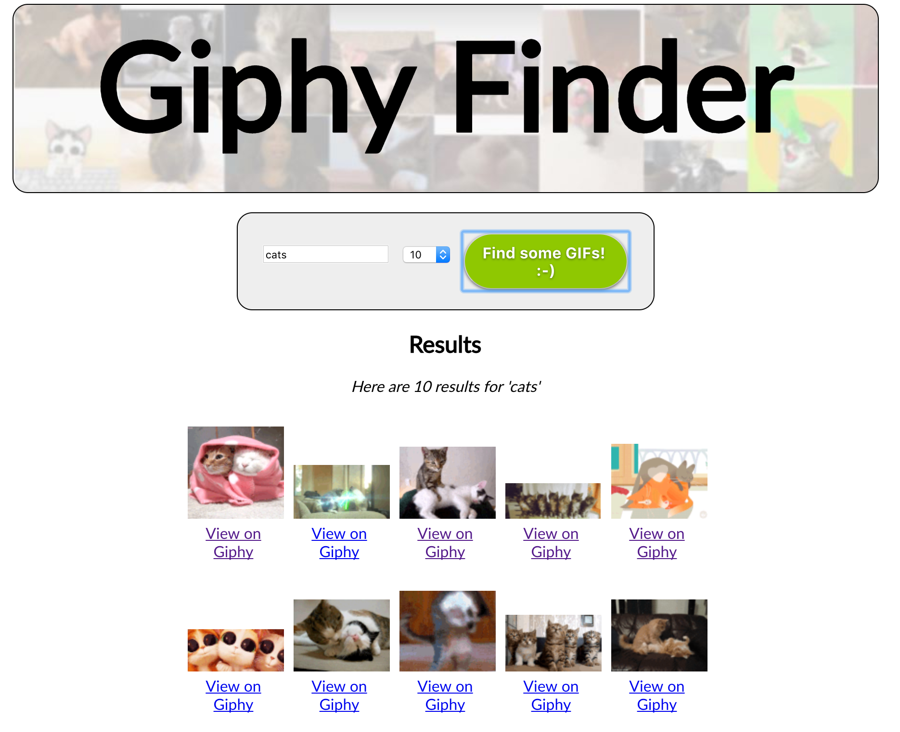

# "GIF Finder" JavaScript Application

*GIF Finder* will utilize the [Giphy web service](https://developers.giphy.com/docs/) to search for GIFs based on keywords, and then display the results to the user. (Make sure you've completed the [Web Services exercise](js9-webservices.md) before attempting this application.)

Here's how the app will work:
  1. The user types in a search term and hits return.
  1. The app creates a properly formatted request URL, including the search term(s), and sends it via http to the web service.
  1. The web service responds by sending back the requested data as a JSON (JavaScript Object Notation) formatted file (this is essentially an object literal containing just data, no methods). 
  1. The app parses the JSON data and displays the results to the user.

## Screen Shots

### Starting State:


### And after the user has made a search:


## Instructions

### Review of Web Service Terms

1. Web Service - http://en.wikipedia.org/wiki/Web_service - A Web service is a method of communication between two electronic devices over World Wide Web. A Web service is a software function provided at a network address over the web or the cloud; it is a service that is "always on" ...
1.  API - http://en.wikipedia.org/wiki/Api - An application programming interface (API) specifies how some software components should interact with each other.
1. Query String - http://en.wikipedia.org/wiki/Query_string - In the World Wide Web, a query string is the part of a uniform resource locator (URL) that contains data to be passed to web applications such as CGI programs.
1. Arguments (or parameters) - http://en.wikipedia.org/wiki/Parameters_(computer_science) - In computer programming, a parameter is a special kind of variable, used in a subroutine to refer to one of the pieces of data provided as input to the subroutine.
1. API Key - http://en.wikipedia.org/wiki/API_key - An application programming interface key (API key) is a code passed in by computer programs calling an API (application programming interface) to identify the calling program, its developer, or its user to the Web site. API keys are used to track and control how the API is being used, for example to prevent malicious use or abuse of the API (as defined perhaps by terms of service).

### Getting Started

Download the [gif-finder-files.zip](gif-finder-files.zip) zip archive. It contains the starting HTML, CSS, and image files for this project. 

You'll also need an API key from https://developers.giphy.com/docs/ -- you need to have a (free) account to set up an application and get a key. You can also try using my API key, `BVPf1N4FwsXGSi2K8gFjlIRscncQb55f`, but there are sometimes problems when multiple people use it from different URLS. 

#### Explanation

The gif-finder.js file is called at the end of the gif-finder.html file. 
Open the gif-finder.js file and look for the numbered comments:

- In #1 we will store the user's search term. It must be in the script scope so that we can access it from outside of our `getData()` function.
- In #2 we create the main `getData` function.
- In #3, we call the function when the button is clicked.

Test the code by clicking the button - and then check the console for the log.

### Capturing User Request and Creating Query URL 
We are going to write a script to create a request URL for the web service. This URL will contain the user's search parameters (search term and number of results).

Add the following instructions to the getData function:

1. Create const values for the base URL and API key. `GIPHY_URL` should be set to `"https://api.giphy.com/v1/gifs/search?"`  `GIPHY_KEY` should be set to the API key. (See instructions above for that.)

2. Create a `url` variable that concatenates `GIPHY_URL`, the string `"api_key="`, and `GIPHY_KEY` to create a string that looks like this: `https://api.giphy.com/v1/gifs/search?api_key=BVPf1N4FwsXGSi2K8gFjlIRscncQb55f` The API identifies you to the server; free keys are limited in the number of queries they can make per day. 

3. Create a variable called `displayTerm` and populate it by using a query selector to find the value of the user-entered search term in the #searchterm input field. 

4. Create another variable called `term`, populate it by using  the `trim` method associated with string objects to get rid of any leading and trailing spaces on displayTerm. 

5. Use the [encodeURIComponent](https://developer.mozilla.org/en-US/docs/Web/JavaScript/Reference/Global_Objects/encodeURIComponent) function to create a URL-friendly version of the URL without spaces or special characters: `term = encodeURIComponent(term);`

6. If there's no term to search, then bail out of the function with `if(term.length < 1) return;`

7. Concatenate the new `term` variable to the end of the `url` string, preceded by `"&q="`. You can do this in either of two ways:
  - `url = url + "&q=" term;`
  - `url += "&q=" term;`

8. Create a new `limit` variable by retrieving the value of the `#limit` element, and add it to the end of the url string preceded by `"&limit="` using either of the approaches shown above. 

9. Update the page to show the search term, by replacing the innerHTML property of the #content element with this string: `"<strong>Searching for " + displayTerm + "</strong>"`

10. Write the resulting URL to the console with `console.log(url);`.


### IV. Testing the URL

Load the gif-finder.html page and click the button. In the console, you should see the newly-constructed URL. 


Clicking on that should open a new browser window that will show you a results page similar to this: 


What you're getting back as a response is a JS Object literal, with a top-level property named `data` that contains an array of objects. Each of these objects represents a animated GIF on Giphy - note some of the properties that will come in handy: `url`, `rating`, `width`, `height` and so on.

### Modify the URL in the location box

In the location bar of the browser, try changing the value of the `q` parameter from `cats` to `dogs` and the `limit` parameter to `2`


### Using jQuery to Parse the Results
To process the data received from the GIPHY server, we are going to use the jQuery library and the `jQuery.ajax()` method.  The AJAX acronym stands for "Asynchronous JavaScript And XML", and is refers to a method for retrieving and parsing XML formatted data using JavaScript. 

We will be talking about jQuery and jQueryUI in more detail next week. For now, we'll simply use it as a tool to accomplish this task.  

A. To import the jQuery library, we will reference it through the <a href="https://developers.google.com/speed/libraries/">Google Hosted Libraries CDN</a>.  Add this script to the head of your document: 

`<script src="https://ajax.googleapis.com/ajax/libs/jquery/3.2.1/jquery.min.js"></script>`

B. In your gif-finder.js file, add this code to the bottom of `getData()`:

```javascript
console.log(jQuery);
console.log($); // $ is an alias to the jQuery object
```

C. Reload the page and click the search button. In the console log you should see something like this, which will confirm that jQuery is loaded:


### VI. Downloading the data with `jQuery.ajax()`

#### A. Using jQuery's AJAX object to download the data from that URL.
We'll use the `jQuery.ajax()` method to pass in a *configuration object* that contains method parameters--most importantly, the URL we want to download, the datatype (JSON) we're using, and the function will be called once the data is loaded (the *callback function*).
 
Add this code to the bottom of `getData()`.
```javascript
$.ajax({
	dataType: "json",
	url: url,
	data: null,
	success: jsonLoaded // the callback function
})
```

#### B. Create the callback function
This function will process the JSON object that the GIPHY service returns.

```javascript
function jsonLoaded(obj) {
	console.log("obj = " + obj);
	console.log("obj stringified = " + JSON.stringify(obj));
}
```
#### Test Your Code 
Reload the page and click the search button. You should see the JSON we download in the console:


### VII. Formatting the results for the user

Now we need to take the results, loop through them, and output the HTML to the page. In the jsonLoaded function, add the following:

```javascript
    // if there are no results, print a message and return
	if(!obj.data || obj.data.length == 0){
		document.querySelector("#content").innerHTML = `<p><em>No results found for '${displayTerm}'</em></p>`;
		$("#content").fadeIn(500);
		return; // Bail out
	}
		
    /* If there is an array of results, loop through them, and create new elements in the HTML to display each of them. */

    let results = obj.data
    console.log("results.length = " + results.length);
    let bigString = "<p><em>Here are " + results.length + " results for '" + displayTerm + "'</em></p>";
		
    for (let i=0;i<results.length;i++){
        let result = results[i];
        let smallURL = result.images.fixed_width_small.url;
        let url = result.url;
        if (!smallURL) smallURL = "images/no-image-found.png";
        
        // ES6 String Templating
        var line = `<div class='result'><a target='_blank' href='${url}'>`;
        line += `<br />View on Giphy</a></div>`;
			
        bigString += line;
	}
		
    document.querySelector("#content").innerHTML = bigString;
```	

Reload the page and click the button; you should see something like this: 


### VIII. Wrap up
When it's done, upload the completed files (HTML, CSS, JS and images) to a folder in your igme230 folder on banjo.rit.edu, and link to it from your main class page as "GIF Finder Exercise" It must be completed by 11:59pm on Sunday, November 5. 


