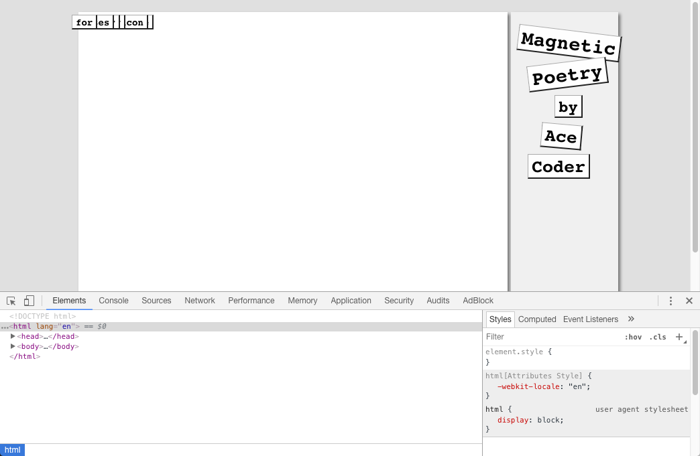

# Magnetic Poetry Exercise: Writing the JavaScript

## Overview
- In this assignment you will create a "magnetic poetry" application that allows the user to reposition words on the screen to create their own poems.
- This assignment uses a lot of the CSS we have seen this semester including *CSS transforms* and *absolute positioning*.
- The completed assignment will also utilize several mouse events, including `mousedown`, `mouseup`, and `mousemove`. 
- To do this assignment, you should have completed at least the 7th web app tutorial page - "JavaScript Object Literals".
- Below is what the completed version will look like: 


## Getting Started
Download the [magnetic-poetry-starter.zip](magnetic-poetry-starter.zip) file. It contains a magnetic-poetry.html file with your starting content, and a magnetic-poetry.css file with the CSS styles for the application. Open the magnetic-poetry.html file in Chrome. It should look like this: 




## Understanding the Page Structure and CSS
Some things to note about the code: 

1. The `#container` div, which will hold all of the app content, is set to 815px in width, and is centered on the page using `margin: 0 auto`. It also has a `position: relative` rule. This is important, because when we use absolute positioning for the word tiles, the position will be calculated based on the *nearest positioned ancestor*. If no other element uses positioning, that will default to the body element. By assigning `position: relative` to the `#container` div, it becomes the nearest positioned ancester. But because we don't actually want to shift the location of the container (beyond centering it on the page), we haven't specified a top or left offsets, and there is no change to the its default position on the page.

1. Note that the words are currently stacked on top of each other. This is because the `.word` class specifies `position: absolute`, but does not include `top` or `left` offsets--as a result, they're all positioned at "0,0" - which is the top left corner of their nearest positioned ancestor (the #container div).

1. The `#fridge` element has a fixed width and height of 640x480px and is floated left. This is where the user will place their magnets.

1. the `#sidebar` element has a fixed width and height of 160x480px and is floated right. This is where the title "tiles" are placed.


## Modifying the Content
1. Currently  `#title4` and `#title5` read "Ace" and "Coder". Change these to your name.

1. If necessary, modify the position, rotation, and/or font-size of the name tiles to keep them contained within the sidebar.

1. If you want to, you can change some words in the word list. (For some ideas, try https://magneticpoetry.com; they provide a word list pdf for all of their sets.) *If you do this, make sure you modify your code for the starting poem to use words that are in your list. You should also remove any phrases or any words with punctuation.* 

## Beginning the Script
You should have noticed that the &lt;script> tag is located in the &lt;head> section. We are going to leave it there, and then add a `window.onload` event to be sure that our DOM manipulation code doesn't run until *after* the page has finished loading.

All of our code is wrapped in a set of curly braces marked "ES6 Block Scope". This is a small change from the default "Script Scope" we have been using, but it will ensure that no code located in other (future) script files can impact our existing JavaScript code.

We are going to use event handlers and regular functions throughout this exercise. Alternatively, you could certainly use event listeners and arrow functions if you so desired.

Add the following functions to the script tag:

1. Give the window.onload event handler an anonymous function to call once the window is loaded. This prevents our application from running before the page has loaded.
```javascript
window.onload = function(){
	setupStartingPoem();
}
```

2. Create a `setStartingPoem()` function that will call `setPosition()` on the 11 words in our starting poem (if you changed the word list, make sure you replace "gibber" with one of the words in your list).
```javascript
function setupStartingPoem(){
	setPosition(getWord("gibber"),150,100);
	// 10 more starting words to come
}
```

3. Create a `setPosition()` function for positioning words. This will later be called from several places in our code. Whenever you have duplicate lines of code, you need to strongly consider factoring it out into its own function or method.
```javascript
function setPosition(word,wordLeft,wordTop){
	word.style.left = wordLeft + "px";
	word.style.top = wordTop + "px";
}
```
4. Create a `getWord()` function that retrieves all of the elements on the page with an `id` of `word`, and then loops through them looking for a match. A limitation of this method is that it will grab the first word of that name it finds, so if you have two words with the same text, the second will be ignored. To avoid the looping, ideally there would have been a CSS selector that allowed you to match elements based on their text, but that was taken out of the HTML5 specification. (FUN FACT: jQuery has the `.contains(text)` method that does just that, but behind the scenes, there is no doubt looping going on.)
```javascript
function getWord(text){
	let allWords = document.querySelectorAll(".word");
	for (let word of allWords){
		if (word.textContent == text){
			return word; // returns matched word, ends loop
		}
		// no match - function returns undefined
	}
}
```

**Go ahead and open your page in Chrome, it should look like this ("gibber"--or the word that you selected--has now moved off of the stack of words in the corner) - if it doesn't, check the JavaScript console:**


## Completing the Starting Poem 
Here is some code you can copy and paste into `setStartingPoem()`. This will position all 11 of the starting words. 

```javascript
setPosition(getWord("gibber"),150,100);
setPosition(getWord("ing"),210,100);
setPosition(getWord("Professor"),253,103);
setPosition(getWord("meep"),350,100);
setPosition(getWord("s"),390,100);

setPosition(getWord("disagreeable"),200,162);
setPosition(getWord("ly"),290,162);
setPosition(getWord("eternal"),330,160);

setPosition(getWord("eldritch"),260,230);
setPosition(getWord("cyclopean"),270,280);
setPosition(getWord("horror"),275,330);
```

**Reload the browser - it should now look like this:**


## Creating Block Variables and Constants
Next we'll add variable that will be used to keep a reference to whatever word the user is currently attempting to drag, and  some useful constants we will need when we start positioning elements on the screen. Put these at the very top of your main block (before the window.onload function).

```javascript
let selectedElement = null;

const TRAY_POSITION = {x:50,y:500};
const MAX_WORD_LEFT = 770;
const LINE_HEIGHT = 30;
const WORD_MARGIN =	10;
const WORD_SPACING = 8;
const MAX_Z_INDEX = 1000;
```

**Go ahead and reload the page, it should look the same. Check the JavaScript console to be absolutely sure there are no errors.**

## Organizing the Word Tiles
Right now most of the words are still stuck in the upper-left corner of the screen. We'll fix that by laying them out in the "word tray" located just under the `#fridge`.

Add the `positionWords` function to your script. It will lay out the words neatly at the bottom of the screen, and to set up the `mousedown` handlers that we will soon need.

```javascript
function positionWords(){
	// See Note 1
	let doMousedown = function(e){
		e.preventDefault();
		selectedElement = e.target;
		selectedElement.style.zIndex = MAX_Z_INDEX;
	};

	// See Note 2
	let allWords= document.querySelectorAll(".word");
	let wordSpacing = WORD_SPACING;
	let wordLeft = WORD_MARGIN;
	let wordTop = TRAY_POSITION.y;

	// See Note 3 
	for (let word of allWords){
		setPosition(word,wordLeft,wordTop);
		let wordWidth = word.clientWidth;
		wordLeft += wordWidth += wordSpacing;
		if (wordLeft >= MAX_WORD_LEFT){
			wordLeft = WORD_MARGIN;
			wordTop += LINE_HEIGHT;
		}
		word.onmousedown = doMousedown;
	}

	// See Note 4
	document.querySelector("#title1").onmousedown=doMousedown;
	document.querySelector("#title2").onmousedown=doMousedown;	document.querySelector("#title3").onmousedown=doMousedown;	document.querySelector("#title4").onmousedown=doMousedown;	document.querySelector("#title5").onmousedown=doMousedown;}
}
```
Call the `positionWords()` function at the top of the `window.onload` callback function. (Make sure it's the first instruction in the function.)

These comments refer to the "See Note x" comments in the code.
1. Uses a high z-index to pop the selected word on top of all other words, and assign it to `selectedElement`. `e.preventDefault` is also interesting; it prevents any default behavior of the mouse down from happening, selecting text or showing tool tips for example. If this was a hypertext link then `preventDefault()` would kill that too.
2. Retrieves all of the `class=word` elements on the screen and puts them into an allWords array. 
3. Positions the words evenly in the area below the "fridge"
4. Assigns the `mousedown` handler to the title words (which doesn't do much yet). 


**Reload the page - all the words should be nicely arranged now. Dragging is not working yet.**


**Important - if your browser is having trouble seeing some of your block variables like `WORD_SPACING` etc, it could be a browser bug (Safari 11 seems to have this issue). To fix it, just delete the 2 top-level braces and put your whole app back into *Script Scope*, that seems to fix the issue on Safari.**

## Implementing Word Dragging
We're almost done - we just need to get the word dragging working by adding support for `mousemove` and `mouseup`. We previously put the `mousedown` handler on each word, but with these next two mouse methods, we need to attach them to the entire document, which makes 100% sense if you think about it for a little while (especially for `mousemove`).

Create the setupDragging function, which will add mouse events to the document so that the user can drag words around. (Consult the notes below for explanations.)

```javascript
function setupDragging(){
	// See Note 1
	document.onmousemove = function(e){
		e.preventDefault();
		if(selectedElement){
			let mousePos = getMousePos(document.querySelector("#fridge"),e);

			// adjust position so we drag words from their center
			mousePos.x -= selectedElement.clientWidth/2;
			mousePos.y -= selectedElement.clientHeight/2;

			setPosition(selectedElement, mousePos.x, mousePos.y);
		}
	};

	//See Note 2
	document.onmouseup = function(e){
		if(selectedElement){
			selectedElement.style.zIndex = MAX_Z_INDEX -1; 
		}
		selectedElement = null;
	};
} // end function setupDragging

//See Note 3
function getMousePos(parentElement,event) {
	let rect = parentElement.getBoundingClientRect();
	return {
		x: event.clientX - rect.left,
		y: event.clientY - rect.top
	};
}
```
Once you've set up both functions, call the `setupDragging()` function at the end of the `window.onload` callback function.

**Reload the page - all the words should be nicely arranged as before. Dragging should now work.**

#### Explanation
- Note 1 above - in `document.onmousemove` we drag the word to the position of the mouse, and have to adjust our coordinates so that we always drag from the middle of the word, not the edge. Note that the **move cursor* that appears when we mouse over the words is done by our CSS.
- Note 2 above - in `document.onmouseup` we clear out `selectedElement`, and make sure that the word we just selected is not at the highest z-index.
- Note 3  above - in our `getMousePos()` helper function we are merely translating the window coordinates we get from the event handler to the equivalent #fridge coordinates. This just means we subtract the left and top values of `#fridge` from the numbers we get from the mouse event. **Example:** 10,10 in window coordinates is roughly 0,0 in `#fridge` coordinates.

## Submission
Upload your files to banjo.rit.edu, and link to them from your class page. They must be submitted by 11:59pm on Wednesday, November 9. 


