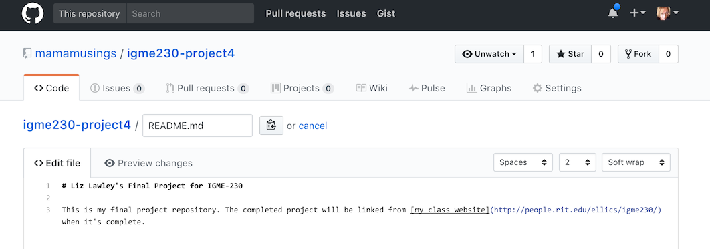
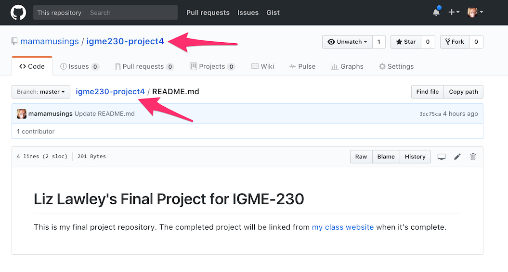
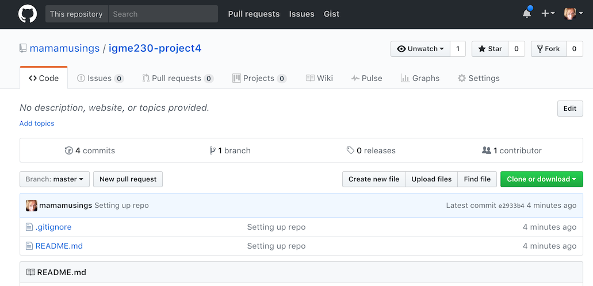

# Week 12 Thursday Exercise (20 April 2017): Project 4 GitHub Refresher & Graphics Resources

## Overview & Goals
Since project 4 requires you to create and regularly commit files to GitHub, you need to be sure you know how to create and maintain a repository for your code. This exercise is not meant to replace the [Week 4 Github exercise](../week4/Git-In-Class-Exercise.pdf), or the version control tutorial you were supposed to do that week--it's simply a quick refresher focused on the things you'll need for this project.

## Creating a New Project on GitHub
Log into [github.com](http://github.com). In the sidebar on the right side of the page, you should see a green button labeled "New Repository"--click that and you'll be taken to a screen where you can specfiy details for the repo. 

Give your repo a meaningful (and not too long) name. Names cannot have spaces, so if you enter spaces into the name, GitHub will convert them to dashes. You can make the repo either private or public. (If you make it private, you'll need to explicitly give me access to it.) Click the box to initialize with a README.md file. Then click the "create" button. (***Note***: If you didn't apply for the [GitHub Student Developer Pack](https://education.github.com/pack) at the start of the semester, you won't have the ability to create a private repo.)

Click the green "Create Repository" button. You should be taken the page for your new repo:

The repo has one commit, because you told GitHub to create and add a "README.md" file to the project. 

## Editing Files Directly on GitHub
In general, it's best if you edit files with a local editor, and push them to the repo when you're done with them. However, in a pinch, it is possible to edit files directly via the GitHub web interface. We're going to do that with the README.md file. 

The "md" extension means the file uses a markup language called Markdown, which is a much simpler markup language than HTML. Most of the content in our class repo, including this exercise, uses Markdown. 

Click on the README.md file in the file listing at the top. In the top right corner, you'll see an edit icon (it's pencil). Click that, and you'll be given an editable version of the document. Modify it to look something like this:

The # indicates a level 1 heading. Links are designated by placing the link text in square brackets, and then placing the target URL in parentheses after it. GitHub has a nice [guide to Markdown syntax](https://guides.github.com/features/mastering-markdown/). 

Once you've edited the file, you can commit your changes to the repo using the button at the bottom of the page. By default, the message will read "Update README.md," but you can always change it to something more descriptive if you'd like.) Once you submit the commit, you'll see the finished document displayed. You can now return to the main page of your repo by clicking on its name, either in the repo path at the top of the screen, or the document path. 

While it's possible to edit project files directly on GitHub, it's not a good approach--the editor is very minimal in function, and it's easy to accidentally lose your work by hitting the wrong key. There's also no way to directly test your code while it's on GitHub, so you can inadvertently introduce errors. 

The better approach is to make a local copy of the repo, do your editing and testing there, and then sync your files with GitHub when you're sure they work. That's what we'll do now. 

## Cloning Your Repo to a Local Machine With VS Code
On the main page of your repo there should be a green button labeled "Clone or Download", and clicking it will show these options:

If you're using the GitHub Desktop application (which is not available on lab computers, but which you can install on your own computer), you can choose the "Open in Desktop" option let the application guide you through the cloning process. If you just want local copies of files, and don't need for your local files to be committed to the repo (for instance, if you want to play with code from someone else's repo), you can choose the "Download ZIP" option. Since you're going to set up a local copy of the repo on your computer that needs to be able to push files to the repo, you just want to copy the URL provided by clicking on the clipboard icon. 

Launch VS Code. On the welcome screen, select the option to "Clone Git repository..." (If you don't see the welcome screen, you can simply press the F1 key to bring up the command palette, and type "clone" to find the Git:clone command). You'll be prompted for the repository URL--paste in the URL that you copied from GitHub. You'll then be asked to specify the path to the parent directory for the repository--the default will probably be your home directory on the computer you're using, and you may want to edit that. Finally, you'll be asked if you want to open the repository when you're done--and you do. You should see your repository directory in the files listin, with the README.md file (which is currently the only file in the repository) listed. Select the README.md file, and you'll see its contenst displayed in the editor window. 

## Creating a .gitignore File
By default, git will track all new files in your directory, and ask you if you want to include them in your commits. If you're using a Mac, most of your directories will have a hidden OS file called `.DS_Store`, which is used by the MacOS, but is not necessary on GitHub or on Banjo. You can tell Git to ignore any `.DS_Store` files by adding them to a .gitignore file in your main repo directory. 

Create a new file in the directory, and put `.DS_Store` in the first line. Save the file with the name `.gitignore` (it should start with a dot, and it should not have a file extension). Because you've added a new file, you should now see a notification on the version control icon in the left sidebar. Ignore it for now. 

Next, edit your README.md file--it can be a small change of a word or two--and save it. Once you've saved it, the notification on the version control icon should change from a 1 to a 2. Click on the version control icon, and you should see something like this:

In the "Changes" list, the new .gitignore file has a gray U next to it because it's currently an "untracked" file--that means that even though it's in the git directory, Git has not yet added it to the repository files being tracked for changes. The README.md file was already part of the repository, so it shows up  with a blue M for "modified". Hovering over the file names will show you two icons--an arrow and a plus sign. If you change your mind and want to discard the changes you made to a file, you can click the arrow. In this case, however, you do want to keep the changes and upload two files to the GitHub repo. 

There are actually three steps involved in getting a new or modified file from your computer to GitHub. The first is staging the file, which you do by clicking on the plus sign button. The second is committing your changed files, which prompts you to add a brief description of your changes, and creates a new save point in your repository that you can revert to later. The third is to actually push your changes to the remote (GitHub) repo. 

Click the plus sign to stage each of the files for committing to the repo (or click the plus sign next to the "Changes" label to stage all changed files); they will move from the "Changes" list to a the "Staged Changes" list, and an option to add a commit message will appear. Type in something brief like "Setting up repo", and click the checkmark icon to commit the changes to your *local* repository.  

Finally, you want to upload the changed files to the repository. To do this, you'll "push" the current commit to GitHub. However, it's a good idea to get in the habit of always doing a "pull" first, in case the files have been modified (either by you or by someone else) since you last downloaded them. (Even if you're the only one with access to edit the repository, you could have introduced changes by editing files directory on GitHub, or by pushing changes from a different computer). You can either select Pull and then Push from the ... menu above the commit message box, or you can choose the "Sync" option. 

***NOTE:*** If you set up your lab computer (or personal computer) with GitHub credentials in the week 4 exercise, this will work smoothly. If you haven't set up your credentials, you'll be prompted for your GitHub user ID and password. Make sure you type them in properly; if you don't, VS Code will sometimes create a bunch of garbage files as a result, and you'll need to delete those files from the file listing so that you don't accidentally commit them to your repo.  

Go back to your GitHub repo page, and refresh it. You should see your changes reflected, with the commit message listed next to each affected file.

## General Tips

You can have multiple copies of the GitHub repo cloned on different computers--your IGM account, your personal desktop or laptop, etc. Make sure that you always pull or sync before pushing, so that you don't run into merge conflicts with files from another copy of the repo. 

It's a good idea to regularly commit changed files to the repo, with a commit message saying what was modified. This makes it easier to roll back to earlier versions if you break something. It also allows me to see that you're making progress on the project--if all your commits are the night before it's due, I will assume that you put very little time and effort into your work.

If you're working with a partner on project 4, figure out who's responsible for which files, so that you don't run into merge conflict problems. (Having separate files for CSS, JavaScript, and SVG helps with this.) Each person should be doing their own commits to the repo, so that I can easily see who did what work.

When working on complex projects, it's a good idea to learn how to create a local branch for making and testing changes, and then merge the branch back into the master once you're sure it's working. The tutorials I assigned in week 4 cover how to do that. 

