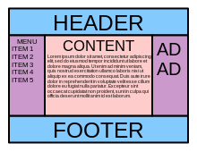

# CSS Flexbox: Holy Grail Exercise

One of the reasons web designers were particularly enthusiastic about the implementation of Flexbox is that it finally provides an elegant solution to the lingering problem of the ["Holy Grail" layout](http://links.lawley.net/holygrail). 

Because I'll be out of town on Thursday, your exercise will be to create a "Holy Grail" page with your own content. It must include your name in the header, and your photo in one of the sidebars. 

There are a number of examples out there to help you with this. You're welcome to use one of those solutions, ***but be sure to credit the source on your page***. 

You should also annotate your CSS, so that I know that you understand what the code you're using actually accomplishes. 

The finished page should be linked from your classwork webpage by noon on Sunday, October 8. 
