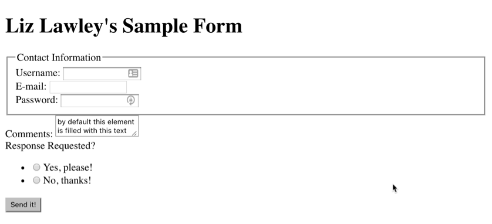

# HTML Forms 

## Overview & Goals
In today's exercise, you'll build a basic HTML form with a variety of input types, and then style it using CSS. 

## Resources
In addition to the readings for today, you will probably find these resources helpful:
- [W3Schools HTML Forms](https://www.w3schools.com/html/html_forms.asp)
- [W3Schools CSS Selectors Reference](https://www.w3schools.com/cssref/css_selectors.asp)
- [MDN CSS Reference](https://developer.mozilla.org/en-US/docs/Web/CSS/Reference)

## Previewing What You're Going to Make
Your finished form should look like this:

 

## Setting Up
Create a folder for this exercise in your igme230 folder. (Since your completed exercise will be linked from your main classwork page, you can name it whatever you'd like.) You'll be creating an HTML file for the form itself, and a CSS stylesheet for the formatting. 

## HTML Form
As usual, you need to start your page with basic HTML 5 structure. (As a reminder, both VS Code and Brackets allow you to simply type HTML:5 and press tab in order to insert a full HTML 5 document structure.)

In the body of the document, add a form element to hold the form content.  

Inside the form, place an `h1` element with the title for the form, something like "Your Name's Example Form". 

Below the heading add a <a href="https://www.w3schools.com/TAgs/tag_fieldset.asp">`<fieldset>` element, and within it include a <a href="https://www.w3schools.com/TAgs/tag_legend.asp">`<legend>`</a> of "Contact Information".

Also inside the fieldset, place three input fields--one for plain text entry of a username, one for an email address, and one for a password. The input fields require three attributes:
- <a href="https://www.w3schools.com/TAgs/att_input_type.asp">"type" specifies what type of input the field is used for</a>; for the user name field you want this to be text, for the email field you want it to be email, and for the password field you want it to be password
- "id" allows us to access that element using Javascript (which is important when we start using form validation scripts)
- "name" is used to collect the user data from the form; every input needs a unique name, which can be the same as the ID, but doesn't need to be

Adding a "value" atribute to an input field sets the default value. That's not necessary in for our first three fields, but will be important for fields where the user doesn't enter the value themselves. 

Each of the input fields also needs a label identifying it. Here's an example of what the username input would look like:

```html
            <label for="username">Username: </label>
            <input type="text" id="username" name="username">
```

Wrap each of the label/input combinations in `<div>` tags so that we can format them easily when we start changing styles. The divs do not need to have unique IDs. 

Below the fieldset, add another div for the comments section. It doesn't need a fieldset, but it does need  a `label` and a method for inputting data, but this time instead of a single-line text `input` element, use the multi-line `textarea` element. Give it both an ID (for CSS purposes) and a name (for data collection purposes) of "comments" 

The last input field to include is a pair of <a href="https://developer.mozilla.org/en-US/docs/Web/HTML/Element/input/radio">radio buttons</a>. With radio buttons and checkboxes, you need to assign the same name attribute to each of the inputs, so that the browser knows to treat them as related options when reporting the user input. You also need to include a value for each radio button, since the user isn't providing text input. 

```html
<div>
    <label for="response">Response Requested?</label>
    <ul>
        <li><input type="radio" name="response" value="yes">Yes, please!</li>
        <li><input type="radio" name="response" value="no">No, thanks!</li>
    </ul>
</div>
```

Finally, at the end of the form, add a submit button. This is <a href="https://www.w3schools.com/TAgs/att_button_type.asp">a button element with a type of "submit"</a>.

Take a look at the form now in a browser. It should show you all of the fields, but it won't be very pretty!

 


## CSS Formatting

Create a .css file for your formatting, and add a link to it from your HTML page. Because you'll be using a Google font (<a href="https://fonts.google.com/specimen/Lato">Lato</a>) for this page, you should also add a link to that from the HTML. (Google fonts can be added either in the HTML as a stylesheet link, or in the CSS as an @import command. It's more common to add it to the HTML, but either method is fine.) 

In your CSS, make Lato the default font-family for the body of the document. 

Now format the form element itself to a have a set width of 600px, a gray (#eee) background, a 1px solid black border, and a border-radius of 1em (to give it rounded corners). Set the margins to `0 auto` so that the form is centered on the page, and add 1em of padding. 

Add a `text-align: center` rule for the h1 heading. 

Next you'll format the fieldset, specifying a dark gray (#999) border with the same rounded corners as on the form. Use margin-top to add some space above the fieldset. Make the text in the legend a bit bigger (I set font-size to 1.2em and font-weight to bolder), and add some padding to the left and right of the text to provide some visual relief between the text and the border.  

The input items need to be spaced out a bit more vertically. Since they're each contained in a div, you change the margin for divs to add some extra space above and below (I used `margin: 1em 0;`). In my example, I had this apply to all divs, but if you only want this to apply to the divs in the fieldset you could use `fieldset>div`)

Next, you need to change the alignment of the input items so that the labels are right-aligned, creating a clean line of inputs. Because the labels are inline items rather than block items, their text alignment can't be modified. However, there's a special display type of <a href="https://www.w3schools.com/css/css_inline-block.asp">"inline-block"</a> that keeps an item in the inline flow, but allows you to manipulate its properties as though it was a block-level item. If you use that, you can set the labels to a fixed width, and then give them a fixed width of 175px and right align the text without breaking the flow of the content.

You also should change the width of the input and textarea fields so that they all have a width of 300px and a 1px solid dark gray (#999) border. 

Take a look at the form now in the browser. The top part of the form should look like the example I provided now, but the bottom still needs some work!

You want the top, not the bottom, of the textarea input field to line up with the label, which you can do by changing its `vertical-align` property to `top`. Make the field a bit taller, too, to be more welcoming to type in; I set mine to a height of 15em.

Now you need to tackle the radio buttons. Unlike the other input fields, they have a label for the group rather than for the indvidual items, and you want the text describing each option to come after the button rather than before it. As a result, you don't want the buttons to have the same 300px width as the other input fields, because that wouldn't leave room for the descriptive text. Using an <a href="https://developer.mozilla.org/en-US/docs/Web/CSS/Attribute_selectors">attribute selector</a>, change the width of the button fields to `auto` by selecting only the input fields with a type of `radio`.  

[Note: After creating this example, I discovered that there's a better way to include labels for each radio button; the next iteration of this exercise will use that!]

The radio buttons are in an unordered list. Remove the bullets in front of each button by changing the list-style for the ul element to none. 

To make the list of options line up vertically with its label, change the display type for the ul from its default of block (which pushes it to a new line) to the inline-block style we used for the labels. Then vertically align it in the same way you did for the `<textarea>` field. It's still not quite right, but you can fix that by setting margin and padding to 0. 

You're almost done! All that's left is to format the button. 

In my example, the button is white with large green text, but it changes to green with white text when you hover over it. Also, to make it more obvious that the button is clickable, I changed the curser to a pointer rather than an arrow.

To accomplish this, I need both a button rule, and a button:hover rule. The first one sets the default state for the button (white background, green text, 1px solid dark gray border, 1.2em font size, and margins set to auto). The second one changes the background to green and the text to white, and also <a href="https://developer.mozilla.org/en-US/docs/Web/CSS/cursor">changes the cursor to a pointer</a> so that it's obvious the button is clickable. 

Only one last thing to do. The button needs to be centered on the page. You *could* add a CSS class or ID to the div containing the button so that you could change the text alignment, but there's a way to do this that doesn't involve modifying the HTML at all. For this project it's overkill, but it's useful to know how to do this using complext CSS selectors, since it's non uncommon in production environments for you to need to format elements on a page without having control over the HTML being generated. 

The <a href="https://developer.mozilla.org/en-US/docs/Web/CSS/:last-child">`:last-child` pseudo class</a> allows you to select the last element among a group of "sibling" elements on a page. However, if we use that on the div element, that creates a small problem. Add this rule, and see what happens: 

```css
div:last-child {
    text-align: center;
}
```

It should indeed center the last div on the page, putting the submit button where you want it. However, notice that it *also* centered the last div inside the fieldset, because those three divs are all siblings, as well. 

To fix that problem, we need to change the rule so that it only selects divs that are the *direct* children of the form--that will exclude the fieldset divs. 

```css
form>div:last-child {
    text-align: center;
}
```

And that's it! The form has been properly styled. 

## From Form to Function

Having a pretty form isn't worth much if it doesn't do anything, though. While we won't be able to do very much with form inputs until we start writing scripts that act on form input, it is possible to generate a simple contact form in HTML that sends the requested data via the user's email program. 

To implement this, you need to give the form an action, so that the browser knows what to do with the information collected. Typically that action is a script, but it's also possible to use a mailto: action, which is what you're going to do. 

As I discussed in class, the information from a form can be sent using either a GET method (which sends the data as a string appended to the URL), or a POST method (which includes it as an attachment to the HTTP request). For a mailto: action, you need to use the POST method, so that the data can be properly processed by your email program. 

Modify your form element as shown. (You can replace the address with your own, or leave it with the placeholder, since you're not actually going to send this message.)

```html
<form action="mailto:xxx9999@rit.edu" method="post">
```

Try clicking the submit button now. It should launch your default email client, and create an email with a blank subject, and a string of variable name/value pairs in the body of the message. Not particularly useful in this form, obviously, but it allows you see what the form output looks like. 


## Submitting Your Work
Upload the completed exercise to Banjo, and ***link to it from your main page.***  It must be submitted by noon tomorrow (Wednesday, October 4).
