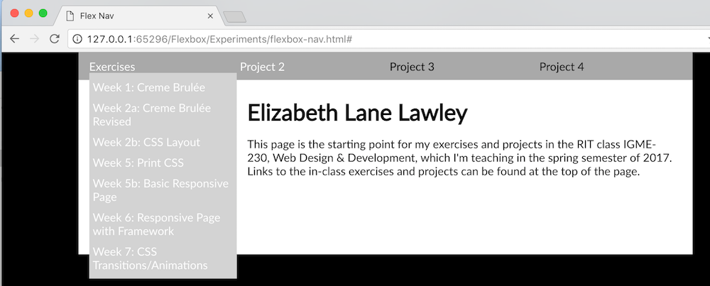
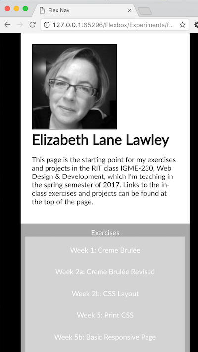

# Week 8 Tuesday Exercise: CSS Flexbox (21 March 2017)

## Overview & Goals
Using CSS Flexbox, you're going to create a new version of your project 1 page, incorporating an image of yourself, your name, and links to your exercises and projects for the class.  

## Previewing What You're Going to Make
Your finished site will have a media query to change the layout when the screen is mobile-sized. Below are screenshots showing the large and small versions:

  

And here they are with their drop-down navigation showing:

  

## Setting Up
Your HTML and CSS files for this exercise will go into a week8 directory in your igme230 directory. You'll be creating an index.html file for the content, and a flexbox.css stylesheet for the formatting. You can either put a copy of the photo you used on your main igme230 page into this directory, or you can link to it in its existing directory. 

## HTML Structure and Content
The index.html page will have two major content sections, which you'll define using the nav and main tags:

```html
<!DOCTYPE html>
<html lang="en">
<head>
    <meta charset="UTF-8">
    <meta name="viewport" content="width=device-width, initial-scale=1, maximum-scale=1.0" />
    <title>Your Name's IGME-230 Classwork, Spring 2017</title>
    <link rel="stylesheet" href="flexbox.css">
</head>

<body>
    <nav>
    </nav>
    <main>
    </main>
</body>
</html>
```

In the navigation section, you'll use unordered lists for the link headings and subheadings, and give each type of list a class so that we can control how it's displayed:

```html
<ul class="navigation">
    <li><a href="#">Exercises</a>
        <ul class="subnav">
            <li><a href="#">Week 1: Creme Brul&eacute;e</a></li>
            <li><a href="#">Week 2a: Creme Brul&eacute;e Revised</a></li>
            <li><a href="#">Week 2b: CSS Layout</a></li>
            <li><a href="#">Week 5: Print CSS</a></li>
            <li><a href="#">Week 5b: Basic Responsive Page</a></li>
            <li><a href="#">Week 6: Responsive Page with Framework</a></li>
            <li><a href="#">Week 7: CSS Transitions/Animations</a></li>
        </ul>
    </li>
    <li><a href="#">Project 2</a>
        <ul class="subnav">
            <li><a href="#">Portfolio</a></li>
            <li><a href="#">Notes</a></li>
        </ul>
    </li>
    <li>Project 3</li>
    <li>Project 4</li>
</ul>
```

Replace the null URL (#) in each of the links with the link to your actual exercise. These can be either relative links (e.g. "../week1/") or full URLs (e.g. http://people.rit.edu/youruserid/igme230/week1/") ***If you didn't yet do a specific exercise or project, remove the `a` tag entirely from that item rather than leaving a null link.***

In the main section, you'll create two divs, one to hold your photo, and one to hold your name and a brief paragraph of text, and give each of them a unique id. 

If you put a copy of your photo in the week8 directory, you can simply reference it by file name in the img tag. If you're linking to the copy in your igme230 directory, your reference will look like this: ``, where photoname.ext is the file name of your photo--the `../` before the file name tells the browser to look one directory above where the current file is located.

```html
<div id="photo">
    
</div>
<div id="about">
    <h1>Your Name</h1>
    <p>Brief (1-2 paragraph) introduction to the page. (See the screenshots above for an example.)</p>
</div>
``` 

## CSS Page Formatting
Before we start working on your flexbox.css file, go to fonts.google.com and choose a font to use for your page. Add the stylesheet link to the font to the head of your HTML file. I used Lato on mine, but you can choose whatever font you'd like. 

In your flexbox.css file, start by setting the background of the html element to a color or image of your choice. (If you use an image, make sure it's either large enough that it won't need to tile, or that it will tile seamlessly.)

Next, give the body element a white background color (or a very pale color of your choice; don't make it a dark color or a pattern). Set the width at 80%, and set the margins to auto; this will center the body on the dark background, leaving space on either side. Add a font-family property here so that all text in the document will use the Google font you selected. 

Here's what the final version of the body styles should look like:

```css
body {
    width: 80%; /* provides space on either side of the content */ 
    margin: auto; /* centers the body in the viewport */
    background-color: white; /* or the light color of your choice */
    font-family: Lato; /* substitute the Google font you chose here */
}
```

## CSS Navigation Formatting

For the navbar, you'll be working with the .navigation class. I made mine darkgrey; you can use a medium-dark color that you think works well with the html and body colors you chose. 

Make it a flex container by setting the display property to flex. You want the navigation items in a row, so set `flex-flow` to `row nowrap`. Left-align the elements in the container by setting the `justify-content` property to `flex-start`. (If you'd prefer a right-aligned menu, you could use `flex-end`; or you could center it by setting it to `center`.) 

You can see good visual examples of what the various flexbox properties do on [A Guide to Flexbox](https://css-tricks.com/snippets/css/a-guide-to-flexbox/).)

Because you don't want the list items to be bulleted and stacked verticially, set the `list-style` to none. Set the margin to 0, and padding to 10px. (Try it without the padding, too, and see what happens.)

```css
.navigation {
    background-color: darkgray; /* choose a medium-dark color to use here */
    display: flex; /* creates a flex container */
    flex-flow: row nowrap; /* specifies the direction and wrap of flow */
    justify-content: flex-start; /* aligns the content along the primary axis--in this case, the row */
    list-style: none; 
    margin: 0;
    padding: 10px;
}
```

Take a look at your page now in a browser. It's starting to look better, but there's a good bit of work left to do!

You created the flex container, but you haven't yet formatted the flex items inside of it--which in this case are the list items.

To format only the li elements inside of the main list, you'll use the `.navigation li` selector. All you need to do is add the flex selector, which takes three properties: flex-grow, flex-shrink, and flex-basis. Since you're goin to use the the default settings, you only need to specify the first number and the rest will be automatically set. I also made all of the list items bold, so that they'd show up better in the navbar.

You also need to change the formatting of links inside of the navigation bar, by taking off the underlining and making them a different color (mine are white  but yours can be a different contrasting color). 

```css
.navigation li {
    flex: 1; /* shorthand property that represents flex-grow of 1, flex-shrink of 1, and flex-basis of auto */ 
    font-weight: bold; 
}

.navigation a {
    color: white; /* or the contrasting color of your choice */
    text-decoration: none; /* turns off underlining */
}
```

Take a look at the page in a browser again--you should see that the list items are nicely spaced in the navigation. 

Now let's tackle those submenus, which are controlled with the .subnav class.

Since you don't want the submenus to display automatically, set the display to none. And since you don't want bullets on the list items, but you do want them stacked vertically, you can set `list-style-type` to none. On my menus I set margin to 0 and adding padding only on the top, but you can play around with those settings to see what you like.

To keep the menu from pushing the content below it down, you'll need to change the position to absolute. Finally, you need to set the background of the submenu to match the main navigation bar. (If you want to make the submenu slightly translucent so you could still see the content below it; if you want to do that, you can use the [MDN Color Picker](https://developer.mozilla.org/en-US/docs/Web/CSS/CSS_Colors/Color_picker_tool) to find the rgb value, and use the rgba format for the color as shown below.)

```css
.subnav {
    background-color: rgba(169, 169, 169,0.9); /* darkgrey RGB value and 0.9 opacity */
    display: none;
    list-style-type: none;
    padding: 10px 0 0 0;
    margin: 0;
    position:absolute;
}
```

To have the menus appear when we hover over a main menu item, you'll need to use the :hover property on the list items in the navigation menu to change the display property from none to block. The `.navigation>li:hover` selector is what you'll need, and you want to change only the .subnav list in the item you're hovering over, so the full selector will be `.navigation>li:hover .subnav`. 

```css
.navigation>li:hover .subnav {
    display: block;
}
```

Finally, you need to format the list items in the submenu. This includes making the submenu list items not bold (they inherited the bold setting from their parent), adding some padding for aesthetics, and making the background color change to black when you hover over the link. 

```css
.subnav li {
    margin: 0;
    padding: 0;
    font-weight: normal;
}

.subnav a {
    display: block;
    text-decoration: none;
    padding: 5px;
}

.subnav a:hover {
    background-color: black;
}
```

Take a look in a browser--hopefully your menu looks and works the way you hoped!

## Formatting the Main Content

The content in the main section looks pretty good, but you're going to take advantage of flexbox formatting so that it reformats nicely as a page gets smaller. 

You'll start by making `main` a flex container, and telling it to wrap content as needed. (Feel free to play with the justify-content and align-items settings here...) I also added padding, again for aesthetic reasons. 

```css
main {
    display: flex;
    flex-flow: row wrap;
    padding: 25px;
}
```

Now we have to define the properties of the flex items inside of the container--the photo and about divs. 

Because I didn't want my photo to automatically scale as the page size changed, I set the flex properties to preventing growing or shrinking: 

```css
#photo {
    flex: 0 0 auto;
}
```

Then I did some minor formatting of my photo:

```css
#photo img { 
    border: 1px solid black;
    margin: 0 20px 0 0;
}
```

The about box was more of a challenge. I wanted it to scale down as the page got smaller, but I didn't want it to be bigger than 600px wide. After a lot of experimenting with flex properties, I ended up with these settings:  

```css
#about {
    flex: 1 1 100px;
    max-width: 600px;
}
```

I wanted the h1 heading to line up properly with the top of the photo, so I set its margin and padding to 0: 

```css
#about h1 {
    margin: 0;
    padding: 0;
}
```

And that's it for the computer-based version of the page! 

## Adding the Responsive Mobile Version 

This design will work well on a tablet-sized device, so you only need to add a media query breakpoint for a mobile device. I set mine to 500px. 

```css
@media all and (max-width: 500px) {

}
```

Within that, you want to do a couple of things to change the way the navigation and content display.

Notice that in the screenshots, the full-size version of the site has the navigation at the top of the page, but the mobile version has the navigation at the bottom. You're going to use flexbox to accomplish that, which means that you need to make the body a flex container.

```css
 body {
    display: flex; /* makes the body a flex container */
    flex-flow: column-reverse; /* makes the elements in the body (nav and main) stack vertically and in reverse order */
    }
```

You also want the content in the main section to flow vertically rather than horizontally:

```css
main {
        flex-flow: column;
    }
```

You also want the navigation, which is now on the bottom, to stack vertically. 

```css
    .navigation {
        flex-flow: column wrap;
        padding: 0;
    }
```

That creates some formatting problems, though. We need to change the way the list items display now, and more importantly, we need to make sure that the submenu doesn't cover up the navigation below it. That means we need to set it back to relative positioning. 

```css
    .navigation li {
        text-align: center;
        padding: 10px;
    }
    .subnav {
        position: relative;
        width: 100%;
        text-align: center;
    }
```

Test your page now--it should work in both full screen and mobile. (This is not the most elegant mobile navigation option, obviously, but it's functional. Feel free to improve on my solution; if you come up with something better, I'll give you bonus points on this assignment that can be applied towards a missing exercise!)

## Submitting Your Work
Upload the entire week8 folder to your igme230 folder on Banjo, and link to it from your main page. It should load properly at people.rit.edu/youruserid/igme230/week8/ . It must be submitted by noon tomorrow (Wednesday, March 22).

(If you would like to replace your existing project 1 with this page, that would be great--many of you currently have pages that make it difficult for us to find your exercises to grade them :) )


