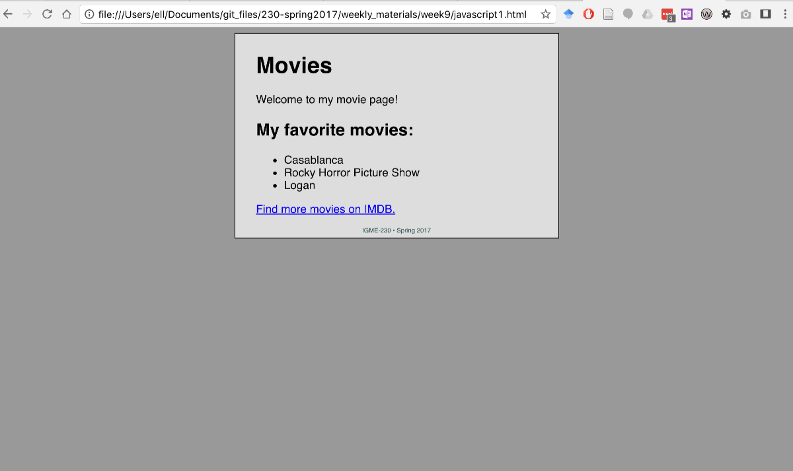
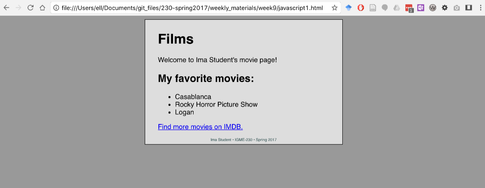

# Week 9 Thursday Exercise: Basic Javascript (3/30/2017)

At the end of this exercise, you should have uploaded two HTML files to a week9 folder inside your igme230 directory on banjo.rit.edu: one called movies.html and one called calculator.html. These files must be uploaded by **noon on Saturday, April 1** for you to receive full credit. 

## Overview & Goals
Front-end programming, typically using JavaScript, is what is used to create interactive browser applications, experiences, and games. Today we'll start using JavaScript to modify elements on a page, and to start developing simple interactive experiences on web pages. 

Some things we'll use JavaScript to change today:
- the text content of HTML elements 
- the values of the CSS attributes of these elements
- the values of HTML attributes - for example a `<p>` element’s class attribute or an `` element's src attribute.
- we can even add or remove HTML elements from the page

JavaScript is triggered by *events* associated with a web page:
- user-generated events, such mouse clicks and rollovers
- browser events, such as the page loading, or data being received from a web service

As we get to more advanced JavaScript coding, you'll see that JavaScript can also be used for a variety of other tasks:
-	play audio or video
-	download data from online services
-	save data for access by the browser (client)
-	access the user’s geographic location
-	draw bitmap and vector graphics 

But for today, we’re  going to focus primarily on updating existing HTML elements on the page. 

## Setting Up
Your files for this exercise will go into a week9 directory in your igme230 directory. 

## Part 1 – Modifying the text contents of HTML elements using JavaScript

Copy and paste the code below into a new HTML document called movies.html

```html
<!DOCTYPE html>
<html lang="en">
<head>
	<meta charset="utf-8" />
	<title>Movies</title>
	<style type="text/css">
		body{
			background-color:#999;
            font-family: Helvetica; 
		}
		
		#content{
			background-color:#ddd;
			padding:5px 30px;
            border: 1px solid black;
			width:400px;
            margin: 0 auto; 
		}
		
		footer{
            font-size: xx-small;
			color:darkslategray;
			text-align:center;
		}
	</style>
	
</head>
<body>
	<div id="content">
	    <h1>Movies</h1>
	    <p>Welcome to my movie page!</p>
	    <h2>My favorite movies:</h2>
            <ul>
            <li>Casablanca</li>
            <li>Rocky Horror Picture Show</li>
            <li>Logan</li>
        </ul>
        <p><a href="http://www.imdb.com">Find more movies on IMDB.</a></p>
        <footer>IGME-230 &bull; Spring 2017</footer>
    </div>

</body>
</html>
```

Save the document, and view it in a browser. It should look like this: 



In the `<head>` of the document, after the CSS section, add this script tag containing two lines of JavaScript, both of which use built-in Javascript functions:

```html
<script>
	alert("Modal alerts are so 80’s!");
	console.log("Use console.log instead!");
</script>
```

Save the file and open it in a browser. When the page loads, you should see the alert from the first line of the script. But where's the output from the second line?

If you're using Chrome, open View->Developer->JavaScript Console--this will open the same Developer Tools window I showed you on Tuesday, but displaying the Console tab rather than the DOM ("Elements") tab. If you're using a different browser, this page lists how to bring up the JavasScript console in each: https://www.wickedlysmart.com/hfjsconsole/) 

Clearly, alert() and console.log() won’t take us very far if we want to build web-based applications. So, let's take the next step, and use JavaScript to access and modify elements on a page.

In the `<head>` of the document, replace your current script with the following:

```html
<script>
    function init(){
        // create a variable called myH1, use the DOM method of querySelector  to retrieve the first h1 element and assign it to that variable
        var myH1 = document.querySelector("h1");

        //change the "innerHTML" content for myH1 to the string "Films"
        myH1.innerHTML="Films";
    }
    
    // immediately call the init() function
    init();
</script>
```

Reload the page. 

Nothing happened, did it? :) 

If you don't still have the Javascript console open, open it again. You should see an error something like this:

```
Uncaught TypeError: Cannot set property 'innerHTML' of null
    at init (javascript1.html:34)
    at javascript1.html:38
```

This error occurred because you were asking the JavaScript to access an element on the page *before* the page had finished loading. The element you were attempting to access (the first `<h1>` in the document) had not yet been loaded into the DOM. As a result, the document.querySelector("h1") method returns a value of null, and  when we try to change the contents of its .innerHTML property, the code fails.

One way to address this problem is to include code in our script that checks to see if the page has loaded before the rest of the script is allowed to run. Another is to place the script at the end of the document, rather than at the beginning. Try moving the script block from the head of the document to just above the closing tag for the body of the document. Save it, and reload. 

What happened this time? Hopefully, the heading at the top of the page changed from "Movies" to "Films"!

Now delete the script from the body of the document, and put this code into the head of the document: 

```html
	<script>
		function init(){
			var myH1 = document.querySelector("h1");
			myH1.innerHTML="Films";
		}
        
        // Call the init function *after* the entire page has loaded

		window.onload = init;

	</script>
```

Save and reload the document--once again, you should see the Movies text in the heading replaced with Films.

There are a few important things to note about the code you just wrote: : 
-  The window object is a global object of the browser, and is always present for any browser window. It has an "onload" event property, which occurs when the entire page and all of the images have loaded. 
- Note that we’re using = init; and not = init(); with parentheses. This is because the closing () will immediately call the function, without first checking if the event trigger has occurred. A “bare” function name like init, as shown above, is actually a variable that points to a function.

**Finishing up Part 1**

Now you're going to do some things without me providing you with the code :) 

1) Add code to the init function that replaces my name in the footer with your name. 

2) Add code to the init function that changes the first paragraph to use your name, rather than the word "my". 

The finished version should look like this:




## Part 2 – More advanced modification of elements using JavaScript

**Changing CSS Properties with JavaScript**

In the previous exercise we changed the innerHTML property of h1, p, and footer elements. Another element property we can change is style, which allows us to alter any existing CSS property.

For example, in the movies.html file we've been working with, we could change the color and background-color of the myH1 variable we created:

```javascript
myH1.style.color="white";
myH1.style.backgroundColor="black";
```

Go ahead and add this code to the init() function in movies.html

**Note**: In CSS, the background-color property has a dash in its name. However, dashes are not allowed in Javascript objects and properties. As a result, when referencing a property with a dash we need to instead use "camel case", where we remove the dash and capitalize the letter following it. 

So, for example, this CSS style rule:
```css
h1{
	font-family: Tahoma;
}
```
Becomes this Javascript property:
```javascript
myH1.style.fontFamily = “Tahoma”;
```

Also, because JavaScript is *Case Sensitive*, you absolutely have to get that capitalization right!


**Executing JavaScript With Button Clicks**

All the JavaScript we’ve done thus far has been executing when the page loads. Now we'll write some code that executes when a button has been clicked.

Add this HTML to the movies.html file, above the footer. 

```html
<button id="redButton">Make this page red!</button>
```

Inside the existing init() function, add the following line:

```javascript
// when #redButton is clicked, call the makeRed() function 
document.getElementById("redButton").onclick = makeRed;
```

Try saving the file and reloading it (with the console open). You should see an error that looks like this: `Uncaught ReferenceError: makeRed is not defined`. That tells us that there is no makeRed function--we can't call it until we write it! 

Add the following code inside of the `<script>` tag - but make sure this new code is NOT inside of the init() function.

```javascript
function makeRed(){
	document.querySelector("body").style.backgroundColor = "red";
}
```
Reload the page again, and try the button; you should be able to click the button and see the background of the document body change from gray to red.

**Changing other HTML element attributes**

We can actually change any attribute of any HTML element with the setAttribute() method. Here’s an example:

```javascript
// add to end of init function
document.querySelector("h1").setAttribute("title", "title creates tool tips");
```
Add this to the end of your init function, and reload the page. When you hover over the "Films" title with the mouse, a tool tip should pop up.

Right click in the browser and “View Page Source” - do you see the changes you’ve made? (For example, the change in the value of the href?) Do you understand why (or why not)? 

Now open  Developer Tools and look at the DOM (the elements tab).  Do you see the changes you’ve made in the inspector? Again, do you understand why (or why not)? 

**Finishing Up Part 2**

Add a second button to the page that make the CSS font-style property of the h1 element italic. Test it to make sure it works. When it does, upload movies.html to the week9 folder on banjo.rit.edu. 


## Part 3:Creating a Simple Calculator

Last week, we looked at how to create basic HTML forms, and I mentioned we'd need those for when we started working with JavaScript. That happens now!

Create a new html document called calclulator.html, with the following content: 
```html
<!DOCTYPE html>
<html lang="en">
<head>
    <meta charset="UTF-8">
    <meta name="viewport" content="width=device-width, initial-scale=1.0">
    <title>Calculator</title>
</head>
<body>
    <p>Number 1: <input type="text" id="num1" value="0" /><br />
    Number 2: <input type="text" id="num2" value="0" /></p>
    <button id="calcButton">Add them Up!</button>
    <p>Results: <p id="results">???</p>
</body>
</html>
```

In order to add up the numbers a user has entered into the input fields, we need to be able to access those values, and also make sure they're treated as numeric values rather than text strings. 

```javascript
var num1 = parseFloat(document.querySelector('#num1').value);
```

*Note*: The parseFloat() function turns the user-entered value retrieved from the #num1 element from a string into a number, so that we can perform an arithmetic calculation with it. (See the documentation at:
https://developer.mozilla.org/en-US/docs/Web/JavaScript/Reference/Global_Objects/parseFloat)

Copy the following code and paste it into your calculator.hml file. Since it the code won't be run until window.onload is triggered, you can put this code into the head of the document. 

```html
<script>
		window.onload = init;
		
		function init(){
			console.log("init called");
			var calcButton = document.querySelector("#calcButton");
			calcButton.onclick = calculate;
		}
		
		function calculate(){
			console.log("calculate called");
			// parseFloat() changes the value of the form field from a String to a Number
			var num1 = parseFloat(document.querySelector('#num1').value);
			// isNaN() is used to see if a value is "Not a Number"
			// if it's not a number, we'll make it zero
			if (isNaN(num1)) num1=0;
			
			var num2 = parseFloat(document.querySelector('#num2').value);
			if (isNaN(num2)) num2=0;
			
			var sum = num1 + num2;
			document.querySelector('#results').innerHTML = sum;
		}
	</script>
```

Save the file, load it in a browser, and see if it works. Then look at all of the code in the example, and make sure you understand what each line is doing. 

**Finishing Up Part 3**

Modify the the HTML to add a third input field. 

Modify the calculate() function so that it adds all three fields together. 

Finally, add another button and associated function that multiply all three values rather than adding them. 

When you're done, test it to make sure it works, and then upload calculator.html to the week9 folder on banjo.rit.edu

## General Coding Advice

- If your code isn’t behaving the way you expect, before asking for help, first try using the console (in Developer Tools) to find your errors. You can view the debugger by right-clicking in the browser window and then choosing Inspect Element
- If you see a syntax error in the  console, note the line number and double check the code on that line, as well as one line above and one line below.
- If your code is not behaving as expected, and you aren’t getting an error message in the debugger, use console.log() to be sure that a function is getting called. A good first place to check is if the init() function is getting called.
- If your JavaScript isn’t working, don’t add any additional code until you've solved the existing problem. Use the debugger first, then ask for help if you can’t find the error.
- Remember that we are using three different languages to create web applications, and they all have their own quirks:
  - HTML is the most forgiving of your mistakes. It’s actually designed to handle mistakes as well as possible.
  - CSS is much less forgiving, but it will still know what you mean if you spell the color white as White or WhItE or wHiTe or white
  - JavaScript is *not* forgiving. It is case sensitive, and very picky about punctuation. 
- As one former student of mine put it when I asked what advice he'd give new students in web development, "[MDN](https://developer.mozilla.org/en-US/) *all* the things!" 


